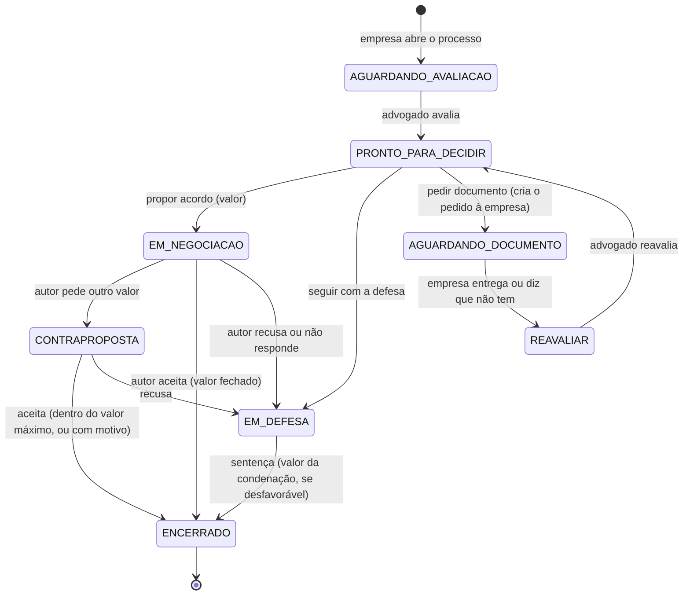

# Fluxo do processo na visão do advogado

A tela só oferece o que cabe na fase atual, e a API recusa o resto (`src/interface/backend/fluxo.py`).
Quem escolheu **acordo** nunca registra "defesa" no fechamento: o único caminho do acordo para a sentença é o
autor recusar ou não responder.

| Fase | O que a tela mostra | O que a API aceita |
|---|---|---|
| Aguardando avaliação | Documentos e o botão de avaliar | Nova avaliação |
| Pronto para decidir | Recomendação e as 3 decisões | Uma decisão, com a avaliação mais recente |
| Documentos novos | Aviso e o botão de reavaliar | Nova avaliação (decisão fica bloqueada) |
| Aguardando documento | O pedido feito e há quantos dias | Nada do advogado; a empresa responde o pedido |
| Em negociação | Roteiro, mensagem de proposta e a resposta do autor | Aceito, contraproposta, recusado, sem resposta |
| Contraproposta | Se o valor pedido cabe no valor máximo | Aceitar (motivo se passar do máximo) ou recusar |
| Em defesa | Registro da sentença | Favorável, ou desfavorável com valor |
| Encerrado | Resultado em dinheiro | Nada |

**Motivo só na divergência.** Seguir a recomendação não pede justificativa. Decidir diferente, propor ou fechar acima
do valor máximo pede um motivo da lista (fato novo, entendimento local, prova mais fraca ou mais forte, sinal do autor,
outro), e "outro" pede o detalhe. Os motivos ficam gravados na decisão para a política aprender com eles.

**Pedir documento** cria o pedido na fila da empresa no mesmo clique. Quando a empresa responde, o processo volta como
"documentos novos" e a decisão final vem depois da reavaliação.

**Fila do advogado** (`GET /api/lawyer/queue`): ordenada pela próxima ação. Negociação sem resposta há 7 dias vira
"cobrar o autor" e sobe para o topo.
